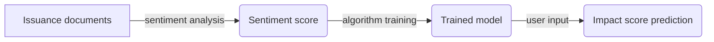

# Greenbond Performance Prediction

Green bonds are fixed-income financial instruments that are used to raise capital for projects that have a *positive environmental impact*. These bonds are issued by governments, municipalities, and private companies to fund initiatives such as renewable energy projects, energy efficiency improvements, and sustainable transportation.

Green bonds typically have the same characteristics as other bonds, such as a fixed interest rate and a specific maturity date, but the proceeds from the sale of green bonds are specifically earmarked for the funding of *green projects*. This allows investors to align their investments with their environmental values and helps to increase the flow of capital towards initiatives that can help address climate change and other environmental challenges.

However, the environmental performance of greenbonds is **not always guaranteed**. Understanding how much impact a bond will have is crucial for climate-conscious investors, which is what this project aims to solve through machine learning techniques. 

# Our approach

The initial step of the project involved analyzing the sentiment of green bond issuance documents using a machine learning-based classifier.
The results of the sentiment analysis were used to train a model that can predict the potential impact score of a given bond from its issuance document.

The workflow is as follow:

# Installation

The code has been designed to be easily accessible without requiring any installation steps.
An [interactive tool](https://www.wolframcloud.com/obj/eric.bolliger/WebServices/GB_formmulti) has been developed to allow investors or interested parties to input green bond documents and receive a prediction of the potential impact score.
 
The system provides a prompt for the user to input the URL of a desired issuance document. 

Upon submission, the user is presented with a menu containing a prediction of the document's impact score, generated using our most accurate predictor.

# Dataset
The data used in the project was sourced from the [TruCost  Environmental database](46https://www.wolframcloud.com/obj/eric.bolliger/WebServices/GB_ImpactScore), which contains extensive information on the environmental impact of over 16,800 companies across various dimensions.
After performing data cleaning, a sample of 377 companies with complete information was used for analysis.

# Implementation 

The project has been carried out on [Wolfram Mathematica](https://www.wolfram.com/mathematica/), using built-in functions. The most notable functions used are `Classify[training,data]` and `Predict[training,input]`.

# Results

The latest version of our predictor function has been trained using a large amount of data and takes multiple variables as input, which increases its overall robustness.
The following are the key performance measures of our predictor:
|                |                          |                       
|----------------|----------|
|Predictor method |`RandomForest`            |
|Number of test examples |`75`            |
|Standard deviation          |`20.5 ± 2.5`|
|Standard deviation baseline |`20.5 ± 2.0`            |
|R-squared |`0.158 ± 0.26`            |
|Mean cross entropy       |`4.44 ± 0.13`|
|Single evaluation time |`5.94ms/example`            |
|Batch evaluation speed     |`917.examples/s`|

# Limitations

The main limitations that come with this project are: 

-   Hypothesis: The sentiment expressed in bond issuance documents can be used to predict bond performance.
-   Built-in functions in Mathematica: The Classify and Predict functions in Mathematica have a proven track record of reliability, but may have limitations in terms of their accuracy.
-   Limited computational capacity: In order to create a user-friendly tool for potential investors, the model must be able to run efficiently and be easy to install.

# Contributors

The project was completed as part of the Data Science and Machine Learning II course taught at the École Polytechnique Fédérale de Lausanne by Professor Michalis Vlachos and Dr. Boris Thurm. The project was carried out by Éric Bolliger, Lucas Spehler, and Rémy Kurum.
